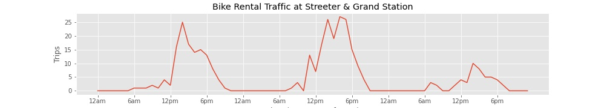
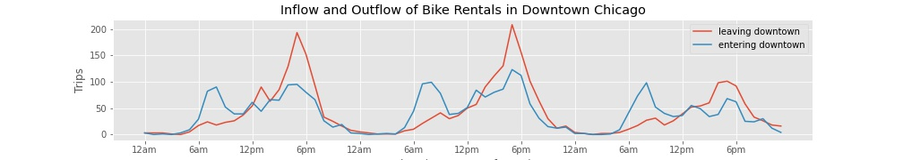
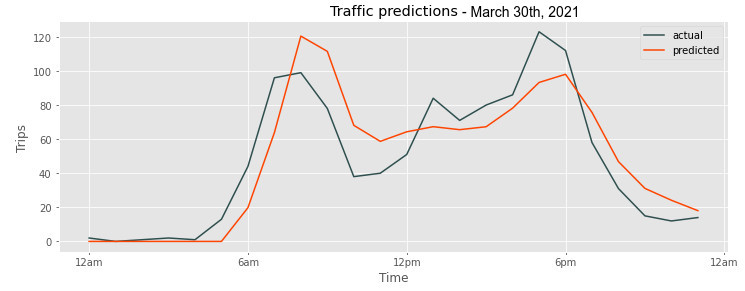
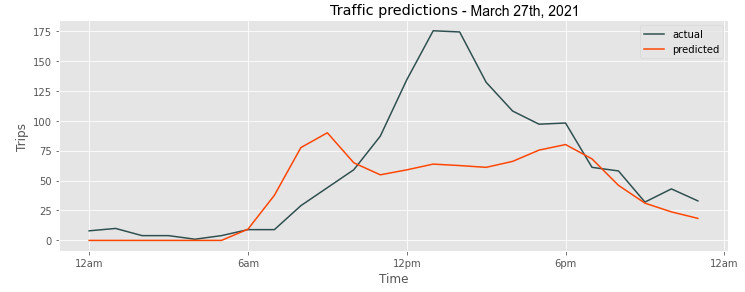
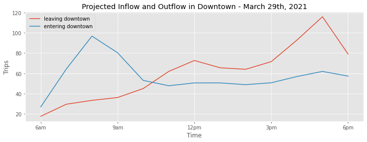

## Project Overview

I made some predictions about how much bike rental traffic there will be in different areas of Chicago.

While there typically isn't too much traffic at individual stations, the influx and outflux of bikes to different service regions can have important logistic and business implications. Monitoring traffic or, even better, predicting the movement of bikes around the city is useful!

>Watch me break down this project in under five minutes in this [video](https://youtu.be/e-K7Wk1LjuU)!
>Or check out the [slide](https://docs.google.com/presentation/d/1q1-8wEhc5NM7hwvC_pcPdODU0MeUuYW5fAwNUWNUK4Y/edit#slide=id.gd11b90b2b9_0_101) version for an easy visual digest.

### Data Source

The Chicago Divvy bike share [data](https://divvy-tripdata.s3.amazonaws.com/index.html)
- 13 columns, ~2 million rows (1/2 year)

## The Data
A slice of the [raw data](https://github.com/nick-kopy/Predicting-Bike-Rental-Station-Traffic/blob/main/data_sample.csv) is included so you can see what incoming information might look like.

This data looks pretty rich and there's a lot of directions you could go with it. In fact here's a [project](https://github.com/nick-kopy/Modeling-Electric-Rental-Bike-Lock-Ups) that explores whether or not people park their electric bikes back at a station. But for now we're interested in start and end stations and where traffic is moving. 

Let's take a look at a single station in more detail. The busiest station in Chicago in the past year was located at Streeter Dr & Grand Ave.

As a simple visualization, let's look at how much traffic there was at this one station on the last three days of our data set. Below are March 29-31st, a Monday to Wednesday, where you can see traffic peaked in the afternoon everyday. Traffic was also much lower on Wednesday compared to earlier.

Next we'll look at how all of the downtown stations looked, with the Streeter and Grand station included. The graph below is almost the same but instead of all traffic, this one is broken down into riders entering downtown and riders leaving downtown. Trips that began and ended within downtown are not included.

We can see some pretty regular trends: a 9am spike, a bit of activity for lunch, and then a 5pm spike. This is pretty likely to be commuters. If you were to instead look at weekend data it's a bit more spread out, without these distinct spikes.

Interestingly about the same amount of riders come into downtown at the beginning and end of the day, but riders leaving downtown are pretty concentrated in the evening.

And in fact you can compare bikes coming in and out not just on the hour, but over time. Over the past six months there's been 6,000 more rides going out than coming in (18,000 in the past year). If bikes are not transported back, they would quickly disappear from downtown. This is a constant in bike share programs, known as rebalancing.

So it's not hard to see how the flow of bikes between areas is an important logistical problem. Getting ahead of the curve before stations start running out of bikes can be the difference between losing loyal customers and keeping commuters happy.

## Predicting Traffic
The simplest prediction is just that for any given hour the amount of bikes entering and leaving an area will be the same as the previous hour. Each prediction will have a unique baseline to compare against, but they will all hover around the average for our data:

>Average bikes entering downtown per hour: 15  
>Average bikes leaving downtown per hour: 14  

We can certainly build a better model than this though. There are plenty of options for making predictions. Another simple prediction is to just guess that traffic will look the same as the day before, hour for hour. The problem here is that traffic isn't only dependent on time, but changes day to day. An ARIMA model is a popular choice that takes into account general trends (many bikeshare programs are growing for example) but has a difficult time with more than one trend pattern at play (known as multi-seasonality). Traffic depends not only on time, but day of the week, month, seasons, holidays, etc. which are totally on their own timelines and are therefor difficult to capture with ARIMA and time series analysis.

Recurrent neural networks are models that can be trained on several months of data and but also have a short term memory that takes into account the most recent information when making predictions. LSTMs (long short term memory) and GRUs (gated recurrent unit) are improved versions that make the most of the memory they have. Let's make a GRU model that can predict what traffic will look like in the next few hours.

>Building models with complex architecture is an iterative process with trial and error and evaluations at every step. To see the GRU RNN models being built and then deployed in action check out this [notebook](https://github.com/nick-kopy/Predicting-Bike-Rental-Station-Traffic/blob/main/prediction.ipynb) that mirrors this write up with all the code!
>
>To REALLY get into the code and look at the GRU architecture, check out the [code script](https://github.com/nick-kopy/Predicting-Bike-Rental-Station-Traffic/blob/main/model_funcs.py) behind all the data cleaning and model processing.

These models were all trained on data from October 2020 until March 2021. There is a model for each of six regions around Chicago but let's stick with downtown because it's the most active and most interesting. During this training the model learning how to take a look at a five day window in the past and predict up to five days into the future. Let's make a simple prediction.

Below the model looks at March 25-29 and makes a prediction for March 30th. In this case it doesn't do a bad job, and improves significantly over just guessing the baseline.

>This model does 60.7% better than baseline

This model is not immune to some of the difficulties other models face. For example if we look at five weekdays and then predict a Saturday, the model does a good job of repeating what it remembers but faces an unexpected change.

Below is a prediction of March 27th, a Saturday, looking at March 22-26, a Monday to Friday. Turns out people don't ride the same way on Saturdays.

>This model does 26.92% better than baseline

It is possible to make a model that looks back farther than five days. More data and more analysis would certainly make a more powerful prediction, but as they say in the math and data science world: there's no free lunch. A longer memory will require more complicated neural network architecture to capture trends and that will in turn require much more processing power.

But for our purposes this model is enough. It doesn't require an inordinate amount of time to train and can look decently enough six to twelve hours into the future.

Here's a hypothetical use case:

This graph has no pre-existing data, it is purely projections into the future. It looks at the past to figure out what traffic in and traffic out will look like for downtown on specifically Monday March 29th from 6am to 6pm. With data collected over the previous five days, it could be run automatically in less than a minute and sent to somebody's dashboard. Training could be done once a month or so to account for larger trends. 

With a little more domain knowledge this becomes pretty useful. The average 8am in-bound spike over the previous 6 months was about 80 rides, meaning this morning might be busy. The average 5pm out-bound spike was almost 150, meaning this evening might be slow.

If you look at the error on these projections they typically do well in the first six hours and start to vary more past that. It's no problem though, we could simply add the latest numbers in and make a new prediction at noon to get an updated projection! And why stop there? We don't need to retrain the model for new predictions, so we could have a rolling prediction that updates every hour!

## Conclusion
Rental bikes have been around for several years now and have a pretty regular customer base by now. There are observable trends in ridership that move up and down across the day, the week, or the year, meaning that by looking at the past you can get a decent idea of how many people will be riding bikes in the future. Artificial intelligence takes past observations and makes future predictions.

We built a recurrent neural network that looks at the past five days and makes a pretty decent prediction of the future 6-24 hours. This can have some great logistical applications, particularly in rebalancing. Predictions tell you what parts of town bikes need to be moved to before stations start running out. You can see in real time how many bikes are left around town, but if you rely on this information alone you're reacting instead of anticipating. There won't be enough bikes and that translates to definite lost revenue and lost customers.

### Future work
Our model did decent, but could definitely be improved upon.
- Dataset included many more features would could be used to make a "multi-variate" model with more numbers to crunch when making predictions.
- Hourly weather data could be included as a feature in a multi-variate model
- The weather forecast could be an incredible piece to help make predictions

### Assumptions

- The past year has been something of an anomaly with the pandemic and all. Can we draw meaningful conclusions from all this that wouldn't just fade away as vaccines roll out and business returns to normal? The numbers [seem to say](https://github.com/nick-kopy/Exploration-of-bike-share-programs-post-pandemic) that even though Chicago's bikeshare program did take a hit initially, it bounced back pretty quick. So assuming that these conclusions and predictions are still relevant despite COVID seems to be a safe assumption.
- Station groupings are loosely based on [this map](https://data.cityofchicago.org/Transportation/Divvy-Bicycle-Stations-All-Map/bk89-9dk7) by on the Chicago Data Portal. These are not official groupings of any kind and are actually not restricted to their labels. What I mean is that some Wicker Park stations are actually in West Town but Wicker Park was just an easy name to go with for that "block" on the map. These models would really benefit (and be more applicable to the business) with relevant and sensical groupings.